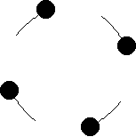

# NBody-Simulation
This is an nbody physics simulator that outputs to a video file

This can handle multiple video streams and physics simulations simulataneously

Trails can be enabled in the world options